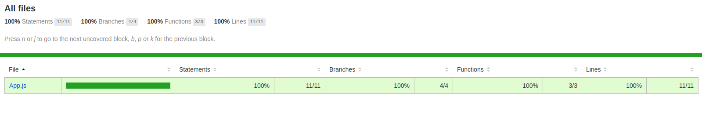

# Counter App

Application to test the change of react component state as you click the increment and decrement counter button.

[](https://sonarcloud.io/summary/new_code?id=alan-nascimento_counter-app)

## Starting

Clone this repository:

```bash
git clone https://github.com/alan-nascimento/counter-app.git
```

### ReactJS Web Application

1. Install dependencies:

```bash
npm install
```

2. Start the application:

```bash
npm run start
```

### Libraries

- [React](https://reactjs.org)
- [Babel](https://babeljs.io/)
- [Jest](https://jestjs.io/)
- [Enzyme](https://github.com/airbnb/enzyme)

## Running unit tests

1. Open a new terminal and run:

```bash
npm run test
```

2. To get coverage tests, run:

```bash
npm run test:coverage
```

3. Go to the project folder: `coverage/lcov-report`.

4. Execute the `index.html` file to view the code covarage:

<br>


